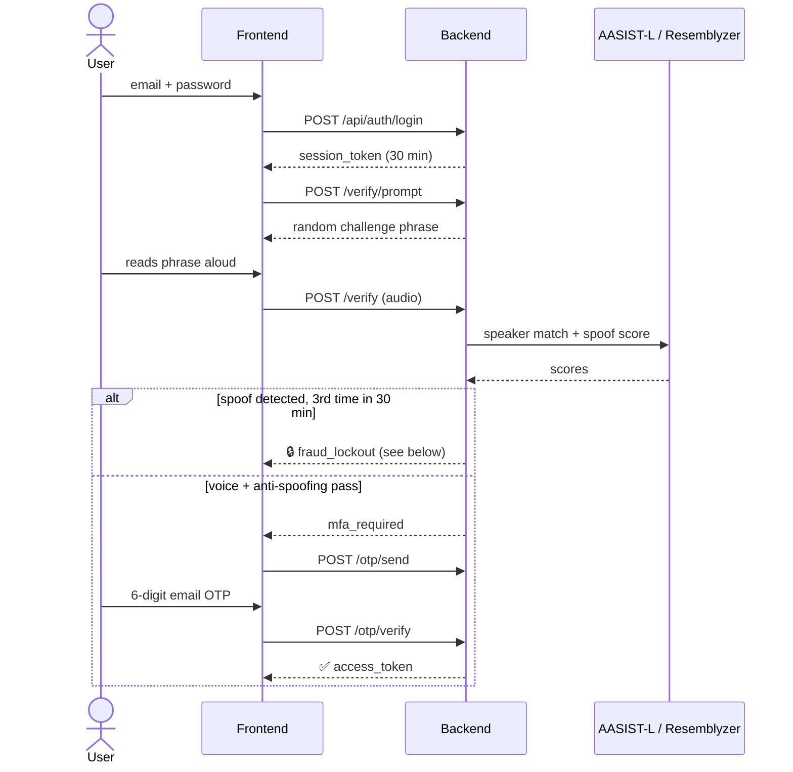
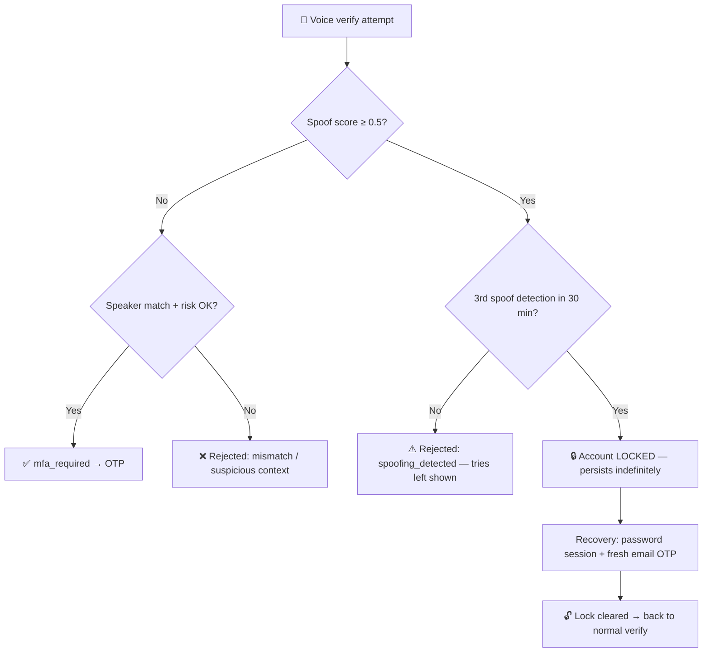
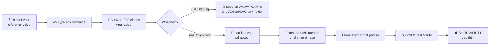

# 🎙️ VoiceProject


A voice-based authentication system combining **speaker verification**, **deepfake/anti-spoofing detection**, and **email OTP** as a second factor — plus a companion tool for red-teaming its own anti-spoofing defenses with a real voice-clone attack.

---

## ✨ Features

| | |
|---|---|
| 🗣️ **Speaker verification** | [Resemblyzer](https://github.com/resemble-ai/Resemblyzer) embeddings, cosine similarity vs. a stored voiceprint |
| 🕵️ **Anti-spoofing** | [AASIST-L](https://github.com/clovaai/aasist), a graph-attention deepfake detector pretrained on ASVspoof2019, running on ONNX Runtime (~2.6x faster than raw PyTorch on CPU) |
| 🎙️ **Server-side phrase verification** | Offline [Whisper](https://github.com/SYSTRAN/faster-whisper) speech-to-text checks what was actually said in the audio — `base` first (~3 s), `small` as a second opinion only when `base` rejects — and the client's own transcript is never trusted for this |
| 📧 **Email OTP 2FA** | 6-digit code, auto-advancing input boxes, auto-submits — no confirm button |
| 🔁 **Random challenge phrases** | never repeats a user's last 10 phrases → resists replay attacks |
| 🔒 **Persistent fraud lockout** | 3 spoof detections in 30 min locks voice auth *indefinitely* — no waiting it out |
| 🆘 **Password + email recovery** | unlocks the account, or re-enrolls a voice that stopped cooperating |
| 🔄 **Blue-green re-enrollment** | new voiceprint fully validated before the old one is ever removed |
| 🛡️ **Hardened auth plumbing** | non-spoofable client IP, account-level login lockout, real session invalidation on logout, persisted per-browser device id |
| 🧪 **Fake Voice Lab** | clone your own voice and attack your own `/verify` endpoint to test it |

---

## 🔄 Authentication Flow



---

## 🔒 Fraud Lockout & Recovery

The lockout **does not expire on a timer** — that's the point. An attacker who trips it can't just wait and try again; only proving account ownership through a separate channel (email) lifts it.



The same recovery endpoints (password + email OTP, no voice needed) also cover a second case — a legitimate voice that just won't verify anymore — in which case success leads into re-enrollment instead of unlocking.

---

## 🏗️ Architecture


| Path | Responsibility |
|---|---|
| `backend/routers/auth.py` | register / login (password only) |
| `backend/routers/voice_auth.py` | consent · verify · OTP · **recovery** (unlock + re-enroll fallback) |
| `backend/routers/enroll.py` | enrollment & re-enrollment sample submission |
| `backend/services/risk_engine.py` | score thresholds, rate limits, the persistent fraud lock |
| `backend/services/anti_spoofing.py` | AASIST-L inference (ONNX Runtime) |
| `backend/services/speaker_verification.py` | Resemblyzer embeddings |
| `backend/services/stt.py` | Whisper speech-to-text (`base` fast pass, `small` second opinion) |
| `backend/services/phrase_check.py` | server-side phrase verification: `base` first, `small` only when `base` rejects |
| `frontend/` | nginx + vanilla HTML/CSS/JS, reverse-proxies `/api/*` |
| `fake-voice-lab/` | standalone voice-clone attack tool (own Dockerfile, own port) |
| `security-tests/` | earlier CLI prototype, superseded by `fake-voice-lab` |

---

## 🚀 Quick Start

```bash
cp .env.example .env   # fill in real values: Gmail app password, JWT secret, etc.
docker compose up -d
```

→ **`http://localhost:3000`**. The backend is never exposed directly — everything routes through nginx.

**First run takes a while — that's expected, not broken:**
- Building the backend image installs the full ML/audio dependency stack (torch, onnxruntime, librosa, scikit-learn, resemblyzer, faster-whisper, ...) from scratch — several minutes depending on your connection.
- The backend then needs several more minutes on top of that to actually become ready: it loads AASIST-L (ONNX), the Resemblyzer speaker encoder, and the two Whisper models before it can serve a single request. The Whisper models live in a Docker volume (`models`, mounted at `/opt/models` via `MODELS_DIR`) rather than under the bind-mounted `backend/`: on Windows/WSL2, reading files of that size through the bind mount hung the process in an uninterruptible disk wait several times. On a fresh clone the volume is empty and faster-whisper downloads `base` and `small` (~600 MB) into it on first start. `docker compose ps` shows it as `health: starting` during this window.
- The frontend deliberately won't start until the backend reports healthy, so `http://localhost:3000` may be unreachable for a few minutes after `up` rather than serving a broken page — see `docker-compose.yml`'s `healthcheck`/`depends_on: condition: service_healthy`.

**If a build looks stuck, don't force-kill Docker processes** (`taskkill` / `Stop-Process -Force` on `com.docker.build.exe`, `docker-compose.exe`, etc.) — killing the wrong internal process mid-build can corrupt Docker Desktop's WSL2 data disk and wipe every image, container, and volume on the machine. If something genuinely hangs, run `docker desktop restart` instead: it's the official, graceful way to reset Docker Desktop's engine without touching the underlying VM disk.

---

## 🧪 Fake Voice Lab

*The premise: if an attacker obtained a short recording of a user's voice, could a commodity zero-shot voice-cloning model clone it convincingly enough to beat this app's own defenses?*



The attack test exercises the full defense stack, not just the spoof detector in isolation: a submitted clone still has to pass speaker verification (does the embedding match the enrolled voiceprint?), server-side phrase verification (does the speech-to-text transcript of the clone actually match the live challenge phrase?), and AASIST-L's spoof score — the same three checks a real forged attempt against `/verify` would have to clear.

Run with `docker compose up -d` from inside `fake-voice-lab/` — it joins the main app's Docker network to reach the real backend directly, the same way an outside attacker's script would talk to it over HTTP. **Only ever point this at an account you own.**

### Why VieNeu-TTS?

Most open Vietnamese voice-cloning models are built on large architectures that assume a GPU is available, which makes them a poor fit for a fully local, CPU-only deployment (2 cores, 12GB RAM, no GPU here) — the kind of environment this project targets so the whole stack, including the attack lab, can run on a single ordinary machine. Three candidates were evaluated before finding one that actually holds up under that constraint:

| # | Model | What happened | Verdict |
|---|---|---|---|
| 1 | **viXTTS** (Coqui XTTS-v2 fine-tuned for Vietnamese) | Produced convincing clones, but XTTS-v2's pipeline (a GPT-style acoustic model plus a vocoder) is heavy without GPU offload — a single inference call pushed memory usage high enough to trigger **31GB** of swap, thrashing disk I/O until the process became unusable | ❌ Needs a GPU to be practical |
| 2 | **v-tts / VALTEC-TTS** | Advertised as a lightweight alternative (~74.8M parameters, small enough for CPU inference) | ❌ The model weights returned an HTTP 401 — the hosting repository isn't actually publicly downloadable despite being advertised as open |
| 3 | **VieNeu-TTS** | Ships a torch-free ONNX CPU inference path with a small (~285MB) footprint, so it doesn't need a full PyTorch/CUDA-oriented stack just to run | ✅ **~14s/sentence, reliable, and light enough to run alongside the rest of the app (Resemblyzer, AASIST-L, Postgres, Redis) on the same machine** |

The deciding factor across all three wasn't voice quality — it was whether the model could run reliably on CPU-only hardware without starving everything else on the box. VieNeu-TTS was the first one that did.

---

## 📝 Notes

- AASIST-L was trained on studio-quality ASVspoof2019 audio. Real browser-recorded audio shifted its scores enough to cause false "spoofing detected" rejections on genuine speech; the recorder explicitly disables the browser's echo-cancellation/noise-suppression/AGC to stay closer to what the model expects. Measuring it later showed the dominant factor is plain **loudness**, not codec compression — see "Measured on real recordings" below — so the server also normalizes speech level before scoring.
- AASIST-L runs from a PyTorch→ONNX export (`backend/scripts/export_aasist_onnx.py`) instead of raw PyTorch — verified numerically identical (< 1e-8 max diff on random inputs) and ~2.6x faster per call (983ms → 378ms on 2 CPU threads), which matters on the resource-constrained hardware below.
- The challenge phrase is checked against server-side speech-to-text output (Whisper `base`, then `small` if `base` rejects), not a client-supplied transcript — a client (browser or script) has no way to skip or fake this check.
- Debugging aid, off by default: if the directory `backend/eval_data/rejected/` exists, the audio of an enrollment sample rejected as a suspected spoof is saved there (score and time in the file name), so a false positive on a genuine voice can be inspected instead of guessed at (`services/debug_capture.py`). `backend/eval_data/` is git-ignored and Docker-ignored because it is where real voice recordings go.
- Single-user personal/academic project — not hardened for multi-user production traffic.
- Developed on a resource-constrained Windows/WSL2/Docker Desktop setup. Stability there needed explicit `.wslconfig` memory/CPU/swap limits and `init: true` on the heavier container (to reap zombie processes from ML library threads) — both host-specific, so `.wslconfig` isn't committed here.
- `backend/tests/` has a pytest suite for the security-critical logic (risk engine decisions, phrase matching, JWT auth-method checks, IP header handling, login lockout) that doesn't need Postgres/Redis running — `pip install -r requirements-dev.txt && pytest` from `backend/`.
- Hardening pass on request/response and container handling, found and verified by actually running the stack rather than just reading the code:
  - `frontend/nginx.conf` raises `client_max_body_size` to 6m. nginx's own default (1m) was stricter than the backend's 5MB audio-size check, so a legitimate recording between 1-5MB got a raw HTML 413 from nginx before ever reaching the backend's JSON error handling.
  - The backend now has a real Docker healthcheck (`docker-compose.yml`, probing `/docs`), and the frontend's startup is gated on it passing. The ASGI app can't accept any connection at all until model loading finishes in its `lifespan` startup hook, so previously nginx started immediately and served instant 502s for the entire multi-minute cold start.
  - `backend/Dockerfile` explicitly preinstalls a CPU-only torch wheel before `pip install -r requirements.txt`. resemblyzer depends on torch internally as a real runtime dependency (not just the AASIST-L export tooling) — without the preinstall, pip resolves it on its own and pulls the much larger default CUDA build instead.
  - Both pip install steps use BuildKit cache mounts rather than `--no-cache-dir`, so a build interrupted partway through (a stalled download on a slow connection) doesn't have to re-fetch every already-downloaded package on the next attempt.
- Risk-engine and enrollment fixes from a code review, each confirmed against the code before changing it:
  - **Enrollment now runs anti-spoofing.** Each enrollment sample goes through the same AASIST-L check as `/verify` (shared `SPOOF_THRESHOLD`), so a synthetic or replayed recording can't become the stored voiceprint. A rejected sample returns `spoof_detected` without advancing enrollment and is deliberately *not* written to `voice_auth_attempts`, so it can't feed the fraud-lockout counter. It is counted separately instead: 10 such rejections per user per hour (`ENROLL_SPOOF_LIMIT`, a Redis counter kept apart from the verify fraud lock) block further enrollment samples with HTTP 429 until the hour has passed, because the `spoof_detected` answer would otherwise be a pass/fail oracle limited only by the 10-per-minute per-IP rate limit. The score is logged server-side only, never returned to the client. Because AASIST-L has shown false positives on genuine browser audio (see above), the threshold should be calibrated against real enrollment recordings.
  - **The "unusual hour" rule used the wrong clock.** `hour_of_day` came from the container's local time, which is UTC, so the "1am–5am" rule actually fired at 8am–noon in Vietnam and never at real night. It now uses Vietnam local time (fixed UTC+7, no DST, so no `tzdata` dependency).
  - **A freshly enrolled user's first verify always looked suspicious.** "Known device/IP" is derived from past non-rejected attempts, and a new user has none, so the first verify was always "new device *and* new IP" and needed the strict match bar (0.85 at the time, 0.78 now) instead of 0.7 — and since a rejection doesn't make a device known, a borderline genuine user could stay stuck at the strict bar. Completing enrollment now records an `enrolled` entry with that request's IP and `X-Device-Id`, which counts as a trusted device/IP.
  - **Audio-quality failures no longer trip the security throttle.** `audio_too_quiet` and `phrase_mismatch` were counted toward the 5-rejections-in-10-minutes limit, so a poor microphone could lock out a genuine user — and since that check only runs after those gates pass, five sloppy takes followed by a good one still came back `rate_limit_exceeded`. They stay in `voice_auth_attempts` as an audit trail but are excluded from the count. This is safe because they are still capped per IP, the challenge phrase changes on every attempt (see below for the actual limit of that), and neither reason involves a voiceprint score an attacker could tune against.
  - **Voiceprint adaptation only follows confident matches.** A successful verify used to nudge the stored template 15% toward the new sample regardless of how it scored, so a near-miss clone that barely cleared 0.7 could drag the template toward itself and make the next attempt easier. The sample is now only kept for adaptation when the match score is at least `ADAPT_MIN_SCORE` (0.85); a session scoring 0.7–0.85 still passes but leaves the template unchanged. Trade-off: a voice that has drifted so far that its scores sit in that band is no longer tracked and will eventually need re-enrollment.
  - **The thresholds can now be measured.** `SPOOF_THRESHOLD` (0.5), `MATCH_THRESHOLD` (0.7) and `STRICT_MATCH_THRESHOLD` (0.78, originally an unmeasured 0.85) in `services/risk_engine.py` started out as engineering defaults rather than measured values, and are being replaced by measured ones as data comes in (see the next bullet). `backend/scripts/evaluate_thresholds.py` scores enrollment, held-out genuine, impostor and voice-clone recordings with the deployed models and reports FRR, FAR and EER at each threshold with 95% confidence intervals (run inside the backend container: `python scripts/evaluate_thresholds.py --enroll … --genuine … --impostors … --clones …`). First small-sample results are in the next bullet; they should be re-measured on more recordings before being relied on.
  - **Measured on real recordings (first pass — small samples, indicative only).** Data: the author's own voice (3 enrollment takes, 14 held-out takes from a desktop recorder, 8 excerpts from a phone call, 3 takes from the app's own browser recorder), 16 impostor clips (7 of one other real person, taken from a call, plus 9 stock TTS-model sample voices) and 10 fake-voice-lab clones. The recordings are not published (they are voice data, one of them a third party's); only aggregate scores are.
    - **Speaker match** (desktop-recorder genuine, n=14, vs impostors n=16 and clones n=10), at the deployed 0.70: 7.1% of genuine takes rejected (1/14, 95% CI 1–31%), 6.2% of impostors accepted (1/16, CI 1–28%), 0% of clones accepted (0/10, CI 0–28%). The genuine-vs-impostor EER is 6.7% at a threshold of 0.706 — i.e. 0.70 sits at the crossover for this data. The clones scored a median 0.56, *below* the impostor median (0.62), so the VieNeu clones fail at speaker match before AASIST is even consulted (with the caveat that `reference.wav` was recorded on a different day and device than the enrollment takes). Against a voiceprint enrolled through the browser itself, the 23 in-app takes scored 0.808 on average (0.655–0.897) and three real verifications about 0.83 (a desktop-recorder voiceprint had matched browser takes only at 0.74–0.77). Longer speech scores higher — the shorter half of the clips averaged 0.776, the longer half 0.837 — so the voiceprint size matters: simulating voiceprints averaged from k in-app takes and tested on the rest, the share of genuine takes under 0.70 was 45.5% (k=1), 16.1% (2), 7.8% (3), 3.9% (5) and 2.1% (8), so enrollment now takes 5 samples instead of 3. Averaging the embeddings beat scoring against each sample separately (the best-of-three rule rejected 11.7% of genuine takes, the mean of similarities 33%). The strict bar used in unusual contexts was a 0.85 default that would have rejected 65–73% of these genuine takes; it is now 0.78, the smallest value at which none of the 26 impostor and clone clips was accepted (the highest scored 0.777) while about 23–33% of genuine takes are rejected, which is acceptable for a bar that applies only in an unusual context. The impostor clips came from other recording domains and only a few speakers, so the false-acceptance side is indicative: a 5-sample voiceprint also lets somewhat more of them through at a fixed threshold (10% against 7% at 0.70), while separating genuine from impostor better overall.
    - **AASIST-L score depends on loudness.** On the same real recording, +6 dB moved the spoof score from 0.024 to 0.521 and from 0.165 to 0.943; raw desktop-recorder audio (RMS about −15 dBFS) was flagged as spoofed 100% of the time, while the browser recorder's quieter output (about −28 dBFS) scored 0.02–0.29. Opus compression and added noise barely moved the score, so codec mismatch is *not* the main driver here. Without a fix, how close someone sits to the microphone decides whether they are flagged — and three flags in 30 minutes lock the account permanently. `services/anti_spoofing.py` therefore normalizes speech level (90th percentile of 50 ms frame RMS) to −40 dBFS before scoring. That target was tuned in two rounds. A first choice of −32 dBFS (from desktop-recorder audio) still flagged 2 of 13 genuine recordings made in the app's own browser recorder, and they were the quiet ones the normalization had *boosted* — the lower the level, the lower the spoof score. Sweeping 13 in-app genuine takes and 10 clones then showed a stable plateau from −39 to −42 dBFS with 0/13 genuine flagged and 10/10 clones flagged; −40 sits in the middle (worst genuine score 0.159, weakest clone 0.585; above −37 genuine speech starts being flagged, below −43 clones start slipping through). On a later, separate set of 10 in-app takes the deployed setting flagged 0/10 (highest score 0.067). Padding short clips with silence instead of repeating them made no difference. Only amplification is capped (at +30 dB); attenuation is not, because a take made right at the microphone needs about 35 dB of cut and an earlier ±30 dB clip left it at −35 dBFS. Boosting the 20 in-app takes by +26 dB to imitate a close mic, that version flagged 2 of 20 (up to 0.71) and at +30 dB flagged 5 of 20 (up to 0.98), while the uncapped cut flagged 0 of 20 at both. The target was picked on small samples from one speaker, with clones fed in directly rather than replayed through a speaker, so it is a starting point to re-check, not a validated constant; phone-call audio is still flagged often (a different domain the app doesn't record in).
    - **Phrase check.** The first design used Vosk (offline Vietnamese speech-to-text) with Whisper as a fallback. On recordings made in the app's own browser recorder Vosk passed almost nothing (0 of 9 at the 0.6 word-match bar; 5 of 17 across all labelled clips, with either model size), so it was replaced. Three suspected causes were tested one at a time: the 48→16 kHz conversion (a proper resampler lifted mean word recall from 0.35 to 0.42 but not the pass count), the decoder search width (8× wider and 8× slower gave identical results), and the browser's own noise suppression/AGC (turning it on made everything worse — Whisper could place only 4 of 10 clips against a pool phrase instead of 9, 3 of 10 were flagged as spoofed instead of 0, and the speaker match dropped — so the recorder keeps it off). The current design is Whisper `base` (beam 5, ~3 s, passed 12 of 15 labelled clips) first and Whisper `small` (~10 s whatever the clip length, because Whisper always processes a 30 s window) only when `base` rejects, both at the same 0.6 threshold (`services/phrase_check.py`). End to end on 8 in-app recordings this took a median of about 9 s per submitted sample (4.5 s when `base` alone passes, ~14 s otherwise), against about 25 s before; every one of the 8 was accepted. Lowering the threshold was measured and rejected: at 0.6, 0 of 1,728 wrong-phrase or free-speech pairs passed; 0.5 already let one through, and it would have rescued only one more genuine take. Constraining the recognizer to the expected phrase (Vosk grammar mode) accepted every correct reading but also 69% of wrong-phrase and 57% of free-speech attempts, so it was not used. The 10 clones fail this check on their own: neither Vosk nor Whisper could transcribe them (1/10 each).
    - **Not measured yet:** anti-spoofing on a proper in-domain set (about 20 or more genuine takes and impostors recorded through the browser, and clones played through a speaker into the mic, which is the real replay path). A temporary "download recording" link and a `?dsp=on` recorder switch were used to collect the browser recordings and the noise-suppression A/B above, then removed once they had answered their questions.
  - **Replay resistance has a real, measured limit.** A stored-audio replay attack (a genuine recording of the victim, captured earlier) can't be caught by AASIST or Resemblyzer — it *is* unmodified real speech, not synthetic. The only thing standing in its way is the phrase challenge not repeating. `services/phrases.py` picks each challenge from a fixed pool of 102 phrases and only excludes the last `PHRASE_HISTORY_SIZE` (10) from repeating — so a phrase is not retired for good, it becomes valid again as soon as it ages out of that window. `tests/test_phrases.py::test_phrase_reappears_once_it_ages_out_of_the_history_window` demonstrates this exactly: with selection made deterministic, the very first phrase issued reappears on the 12th call. Practical implication: an attacker who has accumulated genuine recordings of several of a victim's past challenge phrases has a non-trivial chance of a future challenge matching one they already hold. Voice alone still wouldn't complete login (OTP is always required), but this is a real gap in the "voice" factor's freshness guarantee, not just a theoretical one.
