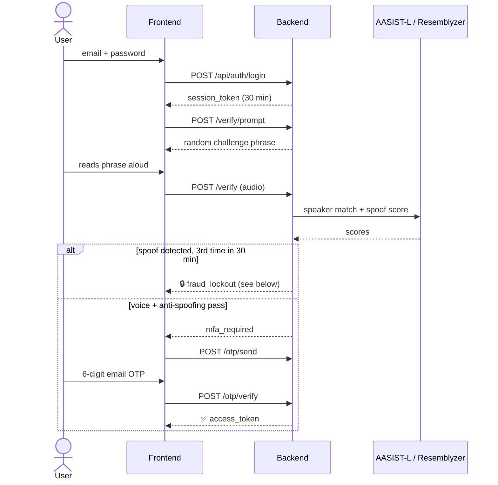
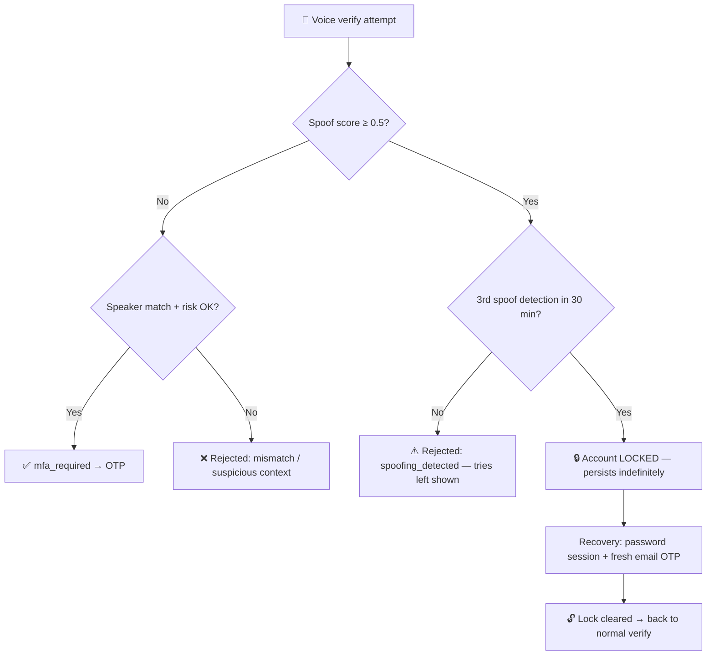
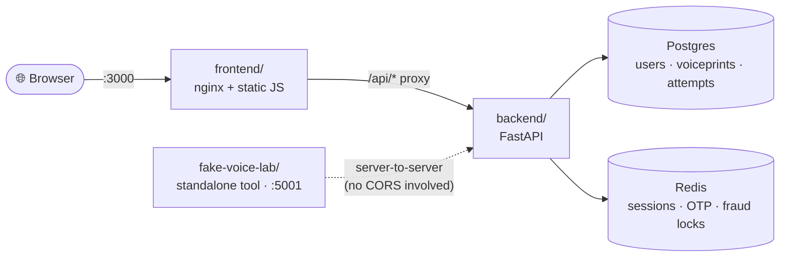
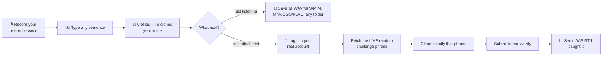

# 🎙️ VoiceProject


A voice-based authentication system combining **speaker verification**, **deepfake/anti-spoofing detection**, and **email OTP** as a second factor — plus a companion tool for red-teaming its own anti-spoofing defenses with a real voice-clone attack.

---

## ✨ Features

| | |
|---|---|
| 🗣️ **Speaker verification** | [Resemblyzer](https://github.com/resemble-ai/Resemblyzer) embeddings, cosine similarity vs. a stored voiceprint |
| 🕵️ **Anti-spoofing** | [AASIST-L](https://github.com/clovaai/aasist), a graph-attention deepfake detector pretrained on ASVspoof2019 |
| 📧 **Email OTP 2FA** | 6-digit code, auto-advancing input boxes, auto-submits — no confirm button |
| 🔁 **Random challenge phrases** | never repeats a user's last 10 phrases → resists replay attacks |
| 🔒 **Persistent fraud lockout** | 3 spoof detections in 30 min locks voice auth *indefinitely* — no waiting it out |
| 🆘 **Password + email recovery** | unlocks the account, or re-enrolls a voice that stopped cooperating |
| 🔄 **Blue-green re-enrollment** | new voiceprint fully validated before the old one is ever removed |
| 🧪 **Fake Voice Lab** | clone your own voice and attack your own `/verify` endpoint to test it |

---

## 🔄 Authentication Flow



---

## 🔒 Fraud Lockout & Recovery

The lockout **does not expire on a timer** — that's the point. An attacker who trips it can't just wait and try again; only proving account ownership through a separate channel (email) lifts it.



The same recovery endpoints (password + email OTP, no voice needed) also cover a second case — a legitimate voice that just won't verify anymore — in which case success leads into re-enrollment instead of unlocking.

---

## 🏗️ Architecture



| Path | Responsibility |
|---|---|
| `backend/routers/auth.py` | register / login (password only) |
| `backend/routers/voice_auth.py` | consent · verify · OTP · **recovery** (unlock + re-enroll fallback) |
| `backend/routers/enroll.py` | enrollment & re-enrollment sample submission |
| `backend/services/risk_engine.py` | score thresholds, rate limits, the persistent fraud lock |
| `backend/services/anti_spoofing.py` | AASIST-L inference |
| `backend/services/speaker_verification.py` | Resemblyzer embeddings |
| `frontend/` | nginx + vanilla HTML/CSS/JS, reverse-proxies `/api/*` |
| `fake-voice-lab/` | standalone voice-clone attack tool (own Dockerfile, own port) |
| `security-tests/` | earlier CLI prototype, superseded by `fake-voice-lab` |

---

## 🚀 Quick Start

```bash
cp .env.example .env   # fill in real values: Gmail app password, JWT secret, etc.
docker compose up -d
```

→ **`http://localhost:3000`**. The backend is never exposed directly — everything routes through nginx.

---

## 🧪 Fake Voice Lab

*If someone got a short recording of my voice, could they clone it and beat my own anti-spoofing model?*



Run with `docker compose up -d` from inside `fake-voice-lab/` — it joins the main app's Docker network to reach the real backend directly. **Only ever point this at an account you own.**

### Why VieNeu-TTS?

Getting a working Vietnamese voice clone on this hardware (2-core CPU, 12GB RAM, no GPU) took three attempts:

| # | Model | What happened | Verdict |
|---|---|---|---|
| 1 | **viXTTS** (Coqui XTTS-v2 fine-tune) | Cloned convincingly, but one inference call caused **31GB** of swap-thrashing disk I/O | ❌ Unusable on this hardware |
| 2 | **v-tts / VALTEC-TTS** | Advertised as lightweight (74.8M params) | ❌ Model weights 401'd — the hosting repo isn't actually public |
| 3 | **VieNeu-TTS** | Torch-free ONNX CPU path, ~285MB footprint | ✅ **~14s/sentence, reliable, works alongside the main stack** |

---

## 📝 Notes

- AASIST-L was trained on studio-quality ASVspoof2019 audio. Real browser-recorded audio — codec compression, echo-cancellation/noise-suppression/AGC — shifted its scores enough to cause false "spoofing detected" rejections on genuine speech; the recorder explicitly disables those browser DSP features to stay closer to what the model expects.
- Single-user personal/academic project — not hardened for multi-user production traffic.
- Developed on a resource-constrained Windows/WSL2/Docker Desktop setup. Stability there needed explicit `.wslconfig` memory/CPU/swap limits and `init: true` on the heavier container (to reap zombie processes from ML library threads) — both host-specific, so `.wslconfig` isn't committed here.
