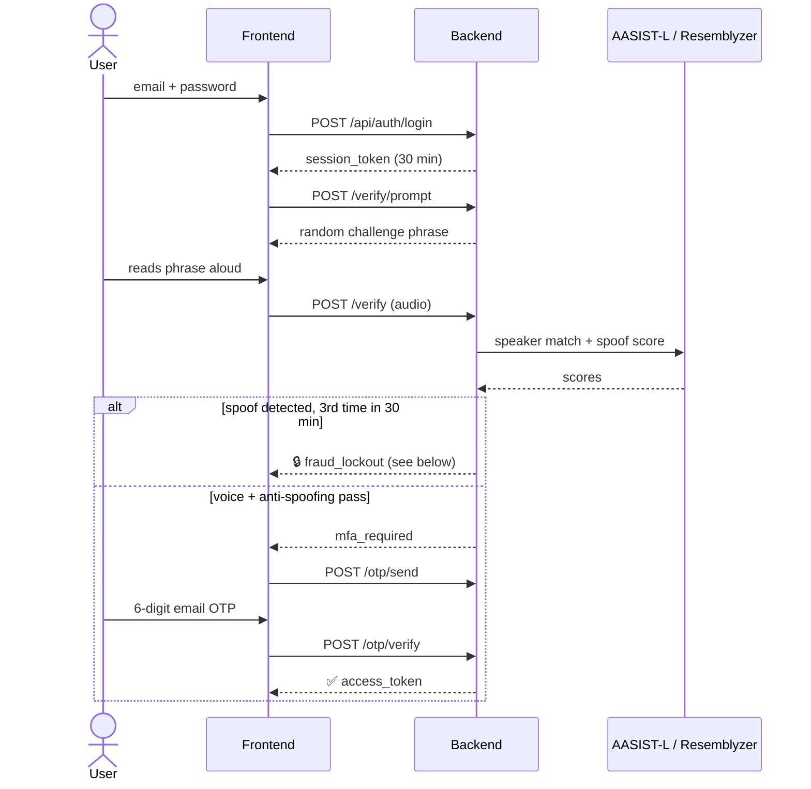
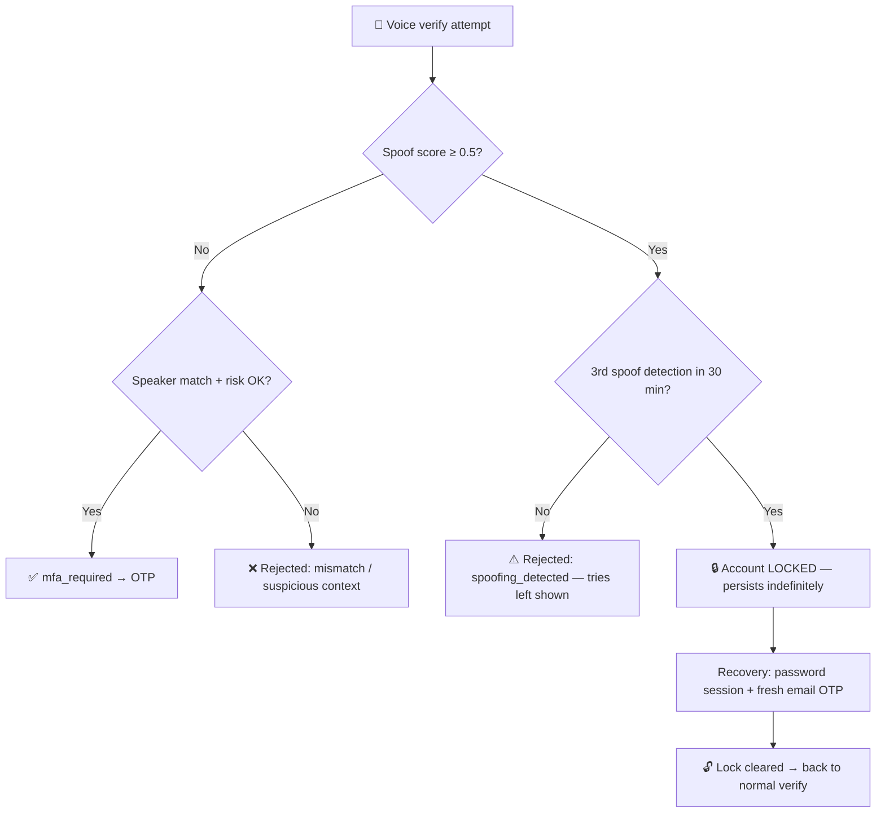
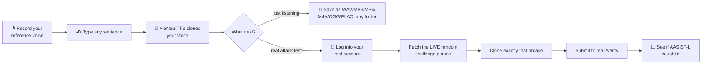

# 🎙️ VoiceProject


A voice-based authentication system combining **speaker verification**, **deepfake/anti-spoofing detection**, and **email OTP** as a second factor — plus a companion tool for red-teaming its own anti-spoofing defenses with a real voice-clone attack.

---

## ✨ Features

| | |
|---|---|
| 🗣️ **Speaker verification** | [Resemblyzer](https://github.com/resemble-ai/Resemblyzer) embeddings, cosine similarity vs. a stored voiceprint |
| 🕵️ **Anti-spoofing** | [AASIST-L](https://github.com/clovaai/aasist), a graph-attention deepfake detector pretrained on ASVspoof2019, running on ONNX Runtime (~2.6x faster than raw PyTorch on CPU) |
| 🎙️ **Server-side phrase verification** | [Vosk](https://alphacephei.com/vosk/) offline Vietnamese speech-to-text checks what was actually said in the audio — the client's own transcript is never trusted for this |
| 📧 **Email OTP 2FA** | 6-digit code, auto-advancing input boxes, auto-submits — no confirm button |
| 🔁 **Random challenge phrases** | never repeats a user's last 10 phrases → resists replay attacks |
| 🔒 **Persistent fraud lockout** | 3 spoof detections in 30 min locks voice auth *indefinitely* — no waiting it out |
| 🆘 **Password + email recovery** | unlocks the account, or re-enrolls a voice that stopped cooperating |
| 🔄 **Blue-green re-enrollment** | new voiceprint fully validated before the old one is ever removed |
| 🛡️ **Hardened auth plumbing** | non-spoofable client IP, account-level login lockout, real session invalidation on logout, persisted per-browser device id |
| 🧪 **Fake Voice Lab** | clone your own voice and attack your own `/verify` endpoint to test it |

---

## 🔄 Authentication Flow



---

## 🔒 Fraud Lockout & Recovery

The lockout **does not expire on a timer** — that's the point. An attacker who trips it can't just wait and try again; only proving account ownership through a separate channel (email) lifts it.



The same recovery endpoints (password + email OTP, no voice needed) also cover a second case — a legitimate voice that just won't verify anymore — in which case success leads into re-enrollment instead of unlocking.

---

## 🏗️ Architecture


| Path | Responsibility |
|---|---|
| `backend/routers/auth.py` | register / login (password only) |
| `backend/routers/voice_auth.py` | consent · verify · OTP · **recovery** (unlock + re-enroll fallback) |
| `backend/routers/enroll.py` | enrollment & re-enrollment sample submission |
| `backend/services/risk_engine.py` | score thresholds, rate limits, the persistent fraud lock |
| `backend/services/anti_spoofing.py` | AASIST-L inference (ONNX Runtime) |
| `backend/services/speaker_verification.py` | Resemblyzer embeddings |
| `backend/services/stt.py` | Vosk speech-to-text, server-side phrase verification |
| `frontend/` | nginx + vanilla HTML/CSS/JS, reverse-proxies `/api/*` |
| `fake-voice-lab/` | standalone voice-clone attack tool (own Dockerfile, own port) |
| `security-tests/` | earlier CLI prototype, superseded by `fake-voice-lab` |

---

## 🚀 Quick Start

```bash
cp .env.example .env   # fill in real values: Gmail app password, JWT secret, etc.
docker compose up -d
```

→ **`http://localhost:3000`**. The backend is never exposed directly — everything routes through nginx.

**First run takes a while — that's expected, not broken:**
- Building the backend image installs the full ML/audio dependency stack (torch, onnxruntime, librosa, scikit-learn, resemblyzer, vosk, ...) from scratch — several minutes depending on your connection.
- The backend then needs several more minutes on top of that to actually become ready: it loads AASIST-L (ONNX), the Resemblyzer speaker encoder, and the Vosk speech-to-text model (downloaded once, cached under `backend/services/weights/`) before it can serve a single request. `docker compose ps` shows it as `health: starting` during this window.
- The frontend deliberately won't start until the backend reports healthy, so `http://localhost:3000` may be unreachable for a few minutes after `up` rather than serving a broken page — see `docker-compose.yml`'s `healthcheck`/`depends_on: condition: service_healthy`.

**If a build looks stuck, don't force-kill Docker processes** (`taskkill` / `Stop-Process -Force` on `com.docker.build.exe`, `docker-compose.exe`, etc.) — killing the wrong internal process mid-build can corrupt Docker Desktop's WSL2 data disk and wipe every image, container, and volume on the machine. If something genuinely hangs, run `docker desktop restart` instead: it's the official, graceful way to reset Docker Desktop's engine without touching the underlying VM disk.

---

## 🧪 Fake Voice Lab

*The premise: if an attacker obtained a short recording of a user's voice, could a commodity zero-shot voice-cloning model clone it convincingly enough to beat this app's own defenses?*



The attack test exercises the full defense stack, not just the spoof detector in isolation: a submitted clone still has to pass speaker verification (does the embedding match the enrolled voiceprint?), server-side phrase verification (does the Vosk transcript of the clone actually match the live challenge phrase?), and AASIST-L's spoof score — the same three checks a real forged attempt against `/verify` would have to clear.

Run with `docker compose up -d` from inside `fake-voice-lab/` — it joins the main app's Docker network to reach the real backend directly, the same way an outside attacker's script would talk to it over HTTP. **Only ever point this at an account you own.**

### Why VieNeu-TTS?

Most open Vietnamese voice-cloning models are built on large architectures that assume a GPU is available, which makes them a poor fit for a fully local, CPU-only deployment (2 cores, 12GB RAM, no GPU here) — the kind of environment this project targets so the whole stack, including the attack lab, can run on a single ordinary machine. Three candidates were evaluated before finding one that actually holds up under that constraint:

| # | Model | What happened | Verdict |
|---|---|---|---|
| 1 | **viXTTS** (Coqui XTTS-v2 fine-tuned for Vietnamese) | Produced convincing clones, but XTTS-v2's pipeline (a GPT-style acoustic model plus a vocoder) is heavy without GPU offload — a single inference call pushed memory usage high enough to trigger **31GB** of swap, thrashing disk I/O until the process became unusable | ❌ Needs a GPU to be practical |
| 2 | **v-tts / VALTEC-TTS** | Advertised as a lightweight alternative (~74.8M parameters, small enough for CPU inference) | ❌ The model weights returned an HTTP 401 — the hosting repository isn't actually publicly downloadable despite being advertised as open |
| 3 | **VieNeu-TTS** | Ships a torch-free ONNX CPU inference path with a small (~285MB) footprint, so it doesn't need a full PyTorch/CUDA-oriented stack just to run | ✅ **~14s/sentence, reliable, and light enough to run alongside the rest of the app (Resemblyzer, AASIST-L, Postgres, Redis) on the same machine** |

The deciding factor across all three wasn't voice quality — it was whether the model could run reliably on CPU-only hardware without starving everything else on the box. VieNeu-TTS was the first one that did.

---

## 📝 Notes

- AASIST-L was trained on studio-quality ASVspoof2019 audio. Real browser-recorded audio — codec compression, echo-cancellation/noise-suppression/AGC — shifted its scores enough to cause false "spoofing detected" rejections on genuine speech; the recorder explicitly disables those browser DSP features to stay closer to what the model expects.
- AASIST-L runs from a PyTorch→ONNX export (`backend/scripts/export_aasist_onnx.py`) instead of raw PyTorch — verified numerically identical (< 1e-8 max diff on random inputs) and ~2.6x faster per call (983ms → 378ms on 2 CPU threads), which matters on the resource-constrained hardware below.
- The challenge phrase is checked against server-side Vosk STT output, not a client-supplied transcript — a client (browser or script) has no way to skip or fake this check.
- Single-user personal/academic project — not hardened for multi-user production traffic.
- Developed on a resource-constrained Windows/WSL2/Docker Desktop setup. Stability there needed explicit `.wslconfig` memory/CPU/swap limits and `init: true` on the heavier container (to reap zombie processes from ML library threads) — both host-specific, so `.wslconfig` isn't committed here.
- `backend/tests/` has a pytest suite for the security-critical logic (risk engine decisions, phrase matching, JWT auth-method checks, IP header handling, login lockout) that doesn't need Postgres/Redis running — `pip install -r requirements-dev.txt && pytest` from `backend/`.
- Hardening pass on request/response and container handling, found and verified by actually running the stack rather than just reading the code:
  - `frontend/nginx.conf` raises `client_max_body_size` to 6m. nginx's own default (1m) was stricter than the backend's 5MB audio-size check, so a legitimate recording between 1-5MB got a raw HTML 413 from nginx before ever reaching the backend's JSON error handling.
  - The backend now has a real Docker healthcheck (`docker-compose.yml`, probing `/docs`), and the frontend's startup is gated on it passing. The ASGI app can't accept any connection at all until model loading finishes in its `lifespan` startup hook, so previously nginx started immediately and served instant 502s for the entire multi-minute cold start.
  - `backend/Dockerfile` explicitly preinstalls a CPU-only torch wheel before `pip install -r requirements.txt`. resemblyzer depends on torch internally as a real runtime dependency (not just the AASIST-L export tooling) — without the preinstall, pip resolves it on its own and pulls the much larger default CUDA build instead.
  - Both pip install steps use BuildKit cache mounts rather than `--no-cache-dir`, so a build interrupted partway through (a stalled download on a slow connection) doesn't have to re-fetch every already-downloaded package on the next attempt.
